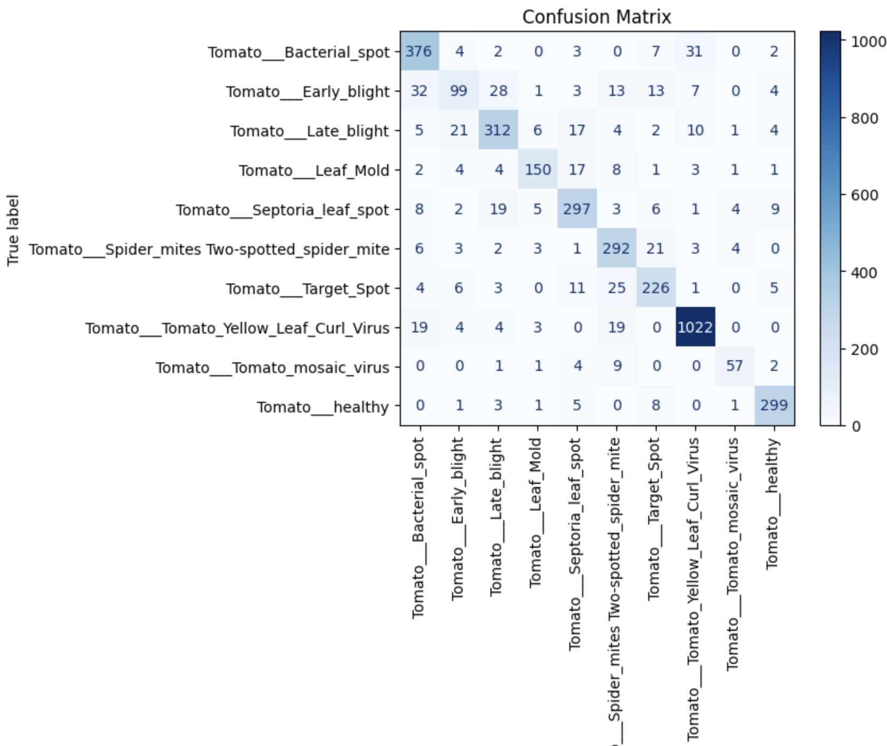
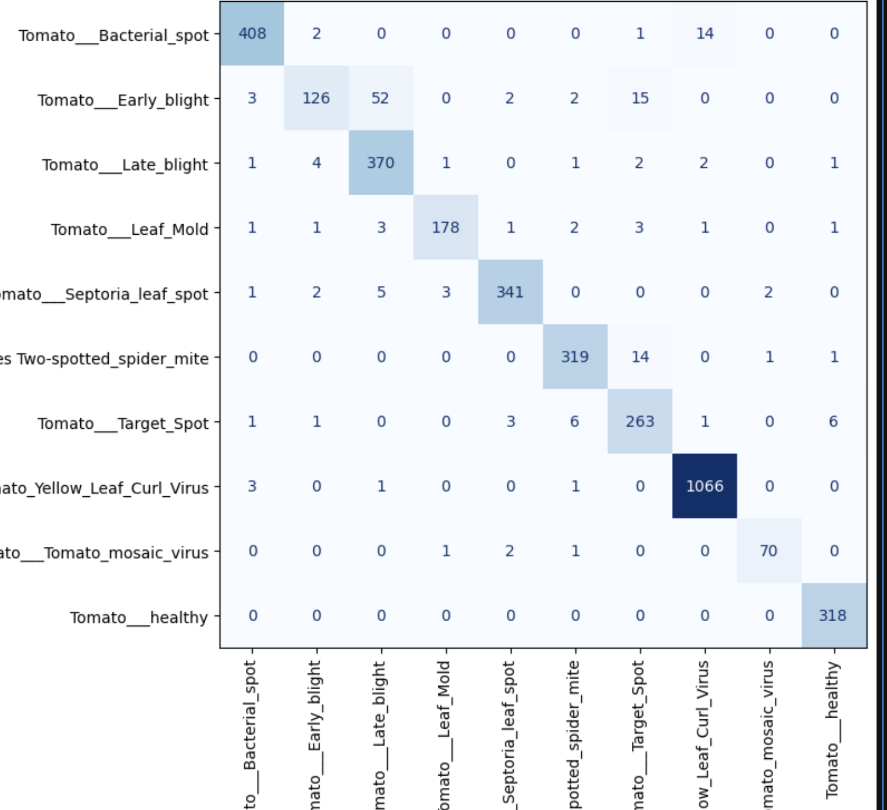
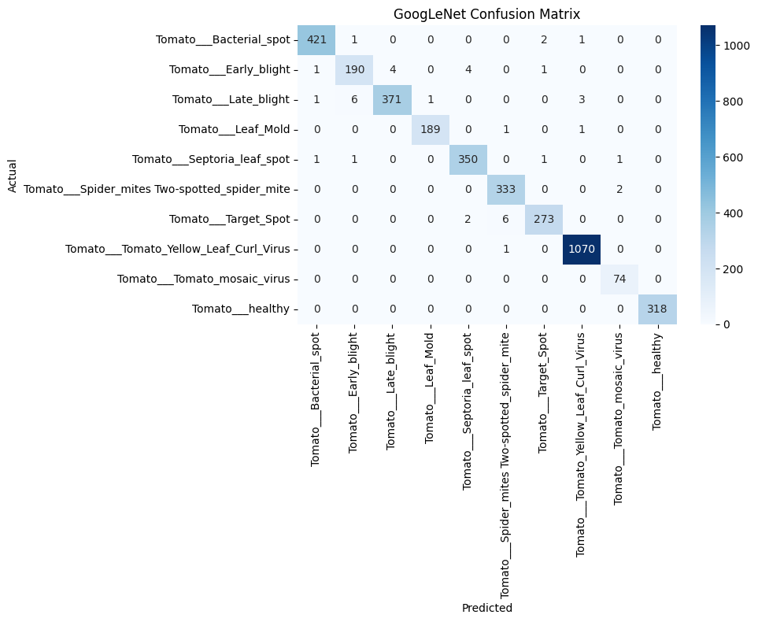
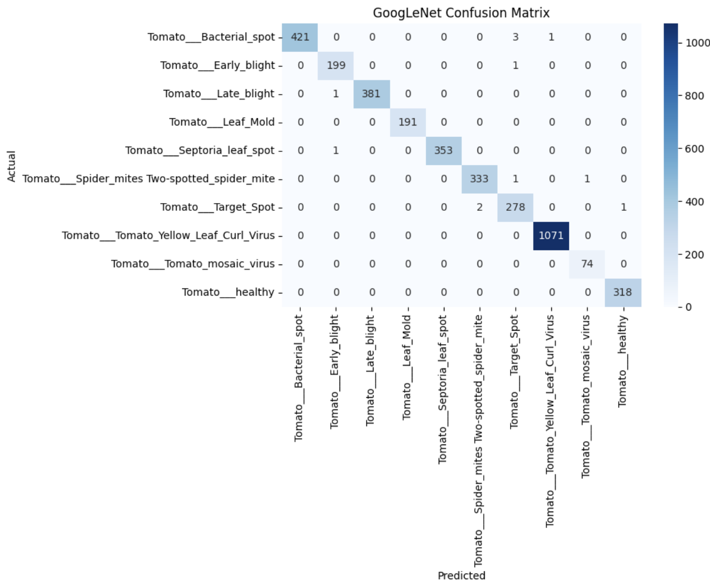

# 🍅 Deep Learning for Tomato Leaf Disease Classification

<p align="center">


</p>

A collection of four progressively advanced image classification projects built to learn deep learning fundamentals, convolutional neural networks, and transfer learning using the PlantVillage Tomato Leaf Disease dataset. The repository demonstrates the evolution from a simple Multilayer Perceptron (MLP) to modern pretrained architectures such as GoogLeNet and ResNet‑50.

---

# 📑 Table of Contents

- Repository Overview
- Learning Objectives
- Tech Stack
- Repository Structure
- Project 1 – MLP
- Project 2 – Custom CNN
- Project 3 – GoogLeNet
- Project 4 – ResNet‑50
- Model Comparison
- Future Work
- How to Run
- Requirements
- Author

---

# 🎯 Learning Objectives

- Build neural networks from scratch using PyTorch.
- Understand image preprocessing pipelines.
- Learn normalization using dataset statistics.
- Implement CNNs manually.
- Apply transfer learning and fine-tuning.
- Improve generalization using augmentation.
- Evaluate models using multiple classification metrics.
- Compare classical and pretrained architectures.

---

# 🛠 Tech Stack

| Category | Tools |
|-----------|------|
| Language | Python |
| Framework | PyTorch |
| Vision | TorchVision |
| Environment | Jupyter Notebook |
| Visualization | Matplotlib, Seaborn |
| Metrics | Scikit-learn |
| Dataset | PlantVillage Tomato |

---

# 📂 Repository Structure

```text
Deep-Learning/
│
├── MLP/
│   ├── notebooks/
│   ├── models/
│   ├── README.md
│   └── confusion_matrix.png
│
├── CNN/
│   ├── notebooks/
│   ├── models/
│   ├── README.md
│   └── confusion_matrix.png
│
├── GoogLeNet/
│   ├── notebooks/
│   ├── models/
│   ├── README.md
│   └── confusion_matrix.png
│
├── ResNet50/
│   ├── notebooks/
│   ├── models/
│   ├── README.md
│   └── confusion_matrix.png
│
├── requirements.txt
└── README.md
```

---

# 🧠 Project 1 — Tomato Leaf Disease Classification using Multilayer Perceptron (MLP)

## Objective
Build a baseline deep learning classifier using a fully connected neural network.

### Dataset
PlantVillage Tomato Dataset (10 classes)

### Model Architecture
- Fully connected layers
- ReLU
- Dropout
- Softmax via CrossEntropyLoss

### Image Preprocessing
- Dataset mean/std computation
- RGB normalization
- Image flattening

### Data Augmentation
Not used.

### Transfer Learning
No

### Optimizer
AdamW

### Scheduler
ReduceLROnPlateau

### Early Stopping
Implemented

### Training Strategy
- Best model checkpoint
- Validation monitoring

### Evaluation Metrics
- Confusion Matrix
- Classification Report
- Precision
- Recall
- F1-score
- Per-class Accuracy

### Final Results
Established a strong baseline for later CNN-based models.

### Confusion Matrix



### Key Learnings
- Fundamentals of feed-forward neural networks.
- Importance of normalization.
- Limitations of flattened image representations.

---

# 🏗 Project 2 — Tomato Leaf Disease Classification using Custom CNN

## Objective
Improve performance by learning spatial image features using convolutional layers.

### Model Architecture
- Convolution
- Batch Normalization
- ReLU
- MaxPooling
- Dropout
- Fully Connected Layers

### Image Preprocessing
- Mean/std normalization

### Data Augmentation
- Random Flip
- Random Rotation
- Random Crop

### Transfer Learning
No

### Optimizer
AdamW

### Scheduler
ReduceLROnPlateau

### Early Stopping
Implemented

### Training Strategy
- Best checkpoint
- Validation monitoring
- Stable validation curves with improved generalization

### Evaluation Metrics
- Confusion Matrix
- Classification Report
- Precision
- Recall
- F1-score
- Per-class Accuracy

### Final Results
Significant improvement over the MLP baseline through learned spatial features.

### Confusion Matrix



### Key Learnings
- CNNs learn local visual patterns efficiently.
- Batch normalization improves convergence.
- Data augmentation enhances robustness.

---

# 🚀 Project 3 — Tomato Leaf Disease Classification using GoogLeNet

## Objective
Leverage transfer learning using ImageNet pretrained GoogLeNet.

### Model Architecture
- ImageNet pretrained GoogLeNet
- Modified classifier for 10 classes

### Image Preprocessing
- Mean/std normalization

### Data Augmentation
- Random crop
- Horizontal flip
- Rotation

### Transfer Learning
Yes

### Optimizer
AdamW

### Scheduler
ReduceLROnPlateau

### Early Stopping
Implemented

### Training Strategy
- Fine tuning
- Best checkpoint
- Test-Time Augmentation (TTA)

### Evaluation Metrics
- Confusion Matrix
- Classification Report
- Precision
- Recall
- F1-score
- Per-class Accuracy
- TTA Accuracy

### Final Results

| Metric | Value |
|---------|------:|
| Validation Accuracy | **98.84%** |
| TTA Accuracy | **99.04%** |
| Precision | **98.85%** |
| Recall | **98.84%** |
| F1-score | **98.84%** |

### Confusion Matrix



### Key Learnings
- Transfer learning dramatically reduces training time.
- Fine tuning extracts domain-specific features.
- TTA provides a measurable accuracy gain.

---

# 🏆 Project 4 — Tomato Leaf Disease Classification using ResNet‑50

## Objective
Build a high-performance classifier using pretrained ResNet‑50.

### Model Architecture
- ImageNet pretrained ResNet‑50
- Modified final fully connected layer

### Image Preprocessing
- Mean/std normalization

### Data Augmentation
- Random crops
- Horizontal flip
- Rotation

### Transfer Learning
Yes

### Optimizer
AdamW

### Scheduler
ReduceLROnPlateau

### Early Stopping
Implemented

### Training Strategy
- Fine tuning
- Best checkpoint
- Test-Time Augmentation (TTA)

### Evaluation Metrics
- Confusion Matrix
- Classification Report
- Precision
- Recall
- F1-score
- Per-class Accuracy
- TTA Accuracy

### Final Results

| Metric | Value |
|---------|------:|
| Validation Accuracy | **99.67%** |
| TTA Accuracy | **99.75%** |
| Precision | **99.67%** |
| Recall | **99.67%** |
| F1-score | **99.67%** |

### Confusion Matrix



### Key Learnings
- Residual connections enable very deep networks.
- Fine tuning yields excellent performance.
- ResNet‑50 produced the best overall results.

---

# 📊 Model Comparison

| Model | Parameters | Transfer Learning | Accuracy | Precision | Recall | F1-score | TTA Accuracy |
|-------|-----------:|:----------------:|---------:|----------:|-------:|---------:|-------------:|
| MLP | N/A | ❌ | — | — | — | — | — |
| Custom CNN | N/A | ❌ | — | — | — | — | — |
| GoogLeNet | ~6.8M | ✅ | 98.84% | 98.85% | 98.84% | 98.84% | 99.04% |
| ResNet‑50 | ~25.6M | ✅ | **99.67%** | **99.67%** | **99.67%** | **99.67%** | **99.75%** |

---

# 🔮 Future Work

- EfficientNet
- Vision Transformers
- ConvNeXt
- Knowledge Distillation
- ONNX/TorchScript deployment
- Grad-CAM explainability

---

# ▶️ How to Run

```bash
git clone https://github.com/your-username/deep-learning.git
cd deep-learning

pip install -r requirements.txt

jupyter notebook
```

---

# 📦 Requirements

```text
python>=3.10
torch
torchvision
numpy
matplotlib
seaborn
scikit-learn
jupyter
```

---

# 👤 Author

**Lucky Singh**

Engineering Student • Machine Learning • Deep Learning • Computer Vision
